# Microsoft Sentinel Demo - Core Workflow Diagram

This diagram shows the complete flow of your Microsoft Sentinel demo, perfect for explaining during your interview.

```mermaid
---
title: Microsoft Sentinel Demo - Core Workflow
config:
  theme: dark
  themeVariables:
    primaryColor: '#1e40af'
    primaryTextColor: '#ffffff'
    primaryBorderColor: '#3b82f6'
    lineColor: '#6b7280'
    secondaryColor: '#374151'
    tertiaryColor: '#111827'
---
flowchart TD
    %% Start Point
    START([👨‍💻 Demo Begins]) --> INIT[🚀 Component Initialization]
    
    %% Initialization Phase
    INIT --> STATE[⚡ React State Setup]
    STATE --> UI[🖥️ Dashboard UI Renders]
    
    %% State Management Detail
    STATE --> |useState Hooks| STATE_DETAILS{🔧 State Variables}
    STATE_DETAILS --> TAB_STATE[activeTab: 'dashboard']
    STATE_DETAILS --> ATTACK_STATE[isAttackActive: false]
    STATE_DETAILS --> LOG_STATE[detectionLog: empty array]
    STATE_DETAILS --> QUERY_STATE[selectedQuery: null]
    
    %% Initial Dashboard View
    UI --> DASH_VIEW[📊 Dashboard View]
    DASH_VIEW --> METRICS[📈 Real-time Metrics]
    DASH_VIEW --> CHARTS[📉 Security Charts]
    DASH_VIEW --> TABS[🗂️ Navigation Tabs]
    
    %% Attack Simulation Flow
    TABS --> |User Clicks| ATTACK_BTN[🔴 Start Attack Simulation]
    ATTACK_BTN --> ATTACK_INIT{🎯 Attack Initialization}
    
    ATTACK_INIT --> RESET_STATE[🔄 Reset All States]
    RESET_STATE --> |"setIsAttackActive(true)"| PHASE_START[📅 Phase 0: Initial Access]
    
    %% Attack Progression Loop
    PHASE_START --> ATTACK_LOOP{🔄 Attack Phase Loop}
    ATTACK_LOOP --> |runPhase Function| CURRENT_PHASE[📍 Execute Current Phase]
    
    CURRENT_PHASE --> PHASE_DATA{📋 Phase Data Processing}
    PHASE_DATA --> |MITRE ATT&CK| MITRE[🎯 T1566.001 - Spearphishing]
    PHASE_DATA --> |IoCs| IOCS[🔍 Indicators of Compromise]
    PHASE_DATA --> |Severity| SEVERITY[⚠️ Medium → High → Critical]
    
    %% Real-time Updates
    PHASE_DATA --> MULTI_UPDATE{⚡ Simultaneous State Updates}
    MULTI_UPDATE --> |setDetectionLog| ALERT_UPDATE[🚨 New Alert Generated]
    MULTI_UPDATE --> |setTimeline| TIMELINE_UPDATE[📅 Timeline Entry Added]
    MULTI_UPDATE --> |setRealTimeData| METRICS_UPDATE[📊 Metrics Incremented]
    
    %% Automated Response Logic
    SEVERITY --> |High/Critical| AUTO_CHECK{🤖 Auto-Mitigation Enabled?}
    AUTO_CHECK --> |Yes| AUTO_RESPONSE[⚡ Automated Response Triggered]
    AUTO_CHECK --> |No| MANUAL_RESPONSE[👤 Manual Response Required]
    
    AUTO_RESPONSE --> |setMitigationActions| MITIGATION_LOG[📝 Mitigation Action Logged]
    
    %% Phase Progression
    CURRENT_PHASE --> |setTimeout| NEXT_PHASE{➡️ More Phases?}
    NEXT_PHASE --> |Yes| PHASE_LOOP[🔄 Next Phase]
    PHASE_LOOP --> |phaseIndex + 1| ATTACK_LOOP
    NEXT_PHASE --> |No| ATTACK_COMPLETE[✅ Attack Simulation Complete]
    
    %% Tab Navigation During Attack
    ALERT_UPDATE --> TAB_SWITCH{🗂️ User Switches Tabs}
    TAB_SWITCH --> |Timeline| TIMELINE_VIEW[📅 Attack Timeline View]
    TAB_SWITCH --> |Detection| DETECTION_VIEW[🚨 Live Alert Feed]
    TAB_SWITCH --> |Hunting| HUNTING_VIEW[🔍 Threat Hunting]
    TAB_SWITCH --> |Response| RESPONSE_VIEW[⚡ Incident Response]
    
    %% Threat Hunting Flow
    HUNTING_VIEW --> QUERY_SELECT[📝 Select KQL Query]
    QUERY_SELECT --> |executeQuery| QUERY_EXEC{⏳ Query Execution}
    QUERY_EXEC --> |"setIsRunningQuery(true)"| LOADING[⏳ Loading State]
    LOADING --> |setTimeout 2s| QUERY_RESULTS[📊 Mock Results Generated]
    QUERY_RESULTS --> |setQueryResults| RESULTS_DISPLAY[📋 Results Table Display]
    
    %% Real-time UI Updates
    TIMELINE_UPDATE --> UI_REFRESH[🔄 React Re-render]
    ALERT_UPDATE --> UI_REFRESH
    METRICS_UPDATE --> UI_REFRESH
    MITIGATION_LOG --> UI_REFRESH
    
    UI_REFRESH --> |Reactive UI| LIVE_DASHBOARD[📺 Live Dashboard Updates]
    
    %% Data Structures
    ALERT_UPDATE --> ALERT_STRUCTURE{📊 Alert Object Structure}
    ALERT_STRUCTURE --> TIMESTAMP[⏰ timestamp: ISO string]
    ALERT_STRUCTURE --> PHASE_NAME[📝 phase: attack phase name]
    ALERT_STRUCTURE --> SEVER_LEVEL[⚠️ severity: Medium/High/Critical]
    ALERT_STRUCTURE --> INDICATOR_LIST[🔍 indicators: IoCs array]
    ALERT_STRUCTURE --> MITRE_MAP[🎯 mitre: ATT&CK technique]
    
    %% Demo Complete
    ATTACK_COMPLETE --> DEMO_END[🎉 Demo Complete]
    DEMO_END --> |"setIsAttackActive(false)"| DISCUSSION[💬 Q&A Session]
    
    %% Styling
    classDef startEnd fill:#16a34a,stroke:#15803d,stroke-width:3px,color:#ffffff
    classDef process fill:#3b82f6,stroke:#2563eb,stroke-width:2px,color:#ffffff
    classDef decision fill:#f59e0b,stroke:#d97706,stroke-width:2px,color:#000000
    classDef data fill:#8b5cf6,stroke:#7c3aed,stroke-width:2px,color:#ffffff
    classDef security fill:#ef4444,stroke:#dc2626,stroke-width:2px,color:#ffffff
    
    class START,DEMO_END,DISCUSSION startEnd
    class INIT,UI,ATTACK_BTN,RESET_STATE,CURRENT_PHASE,AUTO_RESPONSE,MANUAL_RESPONSE process
    class ATTACK_INIT,ATTACK_LOOP,PHASE_DATA,AUTO_CHECK,NEXT_PHASE,TAB_SWITCH,QUERY_EXEC decision
    class STATE_DETAILS,MULTI_UPDATE,ALERT_STRUCTURE data
    class PHASE_START,MITRE,SEVERITY,ALERT_UPDATE,MITIGATION_LOG security
```



---

## 🎯 **Interview Explanation Guide**

### **1. Component Initialization (30 seconds)**
**"Let me walk you through how this Microsoft Sentinel simulation works technically..."**

- **React Setup**: "We start with React functional components and 10 useState hooks"
- **State Management**: "Each hook manages a specific aspect of SOC operations"
- **UI Rendering**: "The dashboard renders with real-time metrics and navigation tabs"

### **2. Attack Simulation Engine (2 minutes)**
**"The core innovation is our realistic attack progression engine..."**

- **User Trigger**: "When the analyst clicks 'Start Attack Simulation'"
- **State Reset**: "We clear previous data and initialize the attack sequence"
- **Recursive Function**: "The `runPhase` function calls itself to create realistic timing"
- **MITRE Mapping**: "Each phase maps to real ATT&CK techniques used by threat actors"

### **3. Real-time Updates (1 minute)**
**"What makes this feel live is the simultaneous state updates..."**

- **Multiple States**: "Each attack phase updates 4+ state variables simultaneously"
- **React Reactivity**: "The UI automatically re-renders when state changes"
- **Live Dashboard**: "Users see metrics increase, alerts appear, timeline build in real-time"

### **4. Automated Response (1 minute)**
**"The system demonstrates modern SOC automation..."**

- **Severity Logic**: "High/Critical threats trigger automated responses"
- **Mitigation Actions**: "System logs what actions were taken"
- **Human Override**: "Analysts can toggle automation on/off"

### **5. Threat Hunting (1 minute)**
**"The hunting interface shows proactive threat detection..."**

- **KQL Queries**: "Real Kusto Query Language used in production Sentinel"
- **Loading States**: "Professional UX with realistic 2-second execution time"
- **Mock Results**: "Believable security data with threat scores"

---

## 🔧 **Technical Deep Dive Points**

### **State Management Architecture:**
```javascript
// This is the heart of the real-time experience:
const runPhase = (phaseIndex) => {
  setLiveAttack(phase);           // Current attack display
  setDetectionLog(prev => [...]);  // Add new alert
  setTimeline(prev => [...]);      // Build investigation timeline
  setRealTimeData(prev => ({...})); // Update dashboard metrics
  
  // Schedule next phase
  setTimeout(() => runPhase(phaseIndex + 1), phase.duration);
};
```

### **Why This Architecture Scales:**
- **Centralized State**: All security data in one component
- **React Patterns**: Standard hooks that scale to enterprise
- **API Ready**: Same structure works with real security APIs
- **Performance**: Efficient re-rendering only where needed

### **Real-World Relevance:**
- **Actual SOC Tools**: This mimics real Sentinel interfaces
- **Industry Standards**: MITRE ATT&CK, KQL, IoCs are all production concepts
- **Enterprise Integration**: Architecture ready for real security platforms

---

## 📊 **Data Flow Summary**

```
User Action → State Updates → Attack Simulation → Real-time Alerts → 
Automated Response → Timeline Building → Threat Hunting → Results Display
```

This workflow demonstrates:
1. **Modern React Development** (hooks, state management, component architecture)
2. **Security Domain Expertise** (MITRE ATT&CK, threat hunting, SOC operations)  
3. **System Design Skills** (real-time updates, scalable architecture, enterprise integration)
4. **User Experience** (loading states, professional UI, intuitive navigation)

Perfect for showcasing full-stack development skills in the cybersecurity domain!
